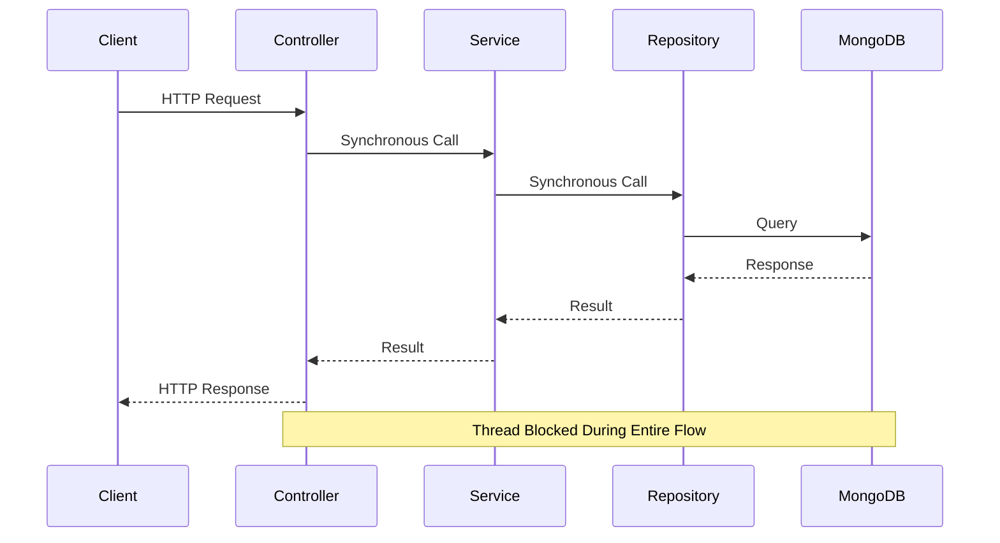
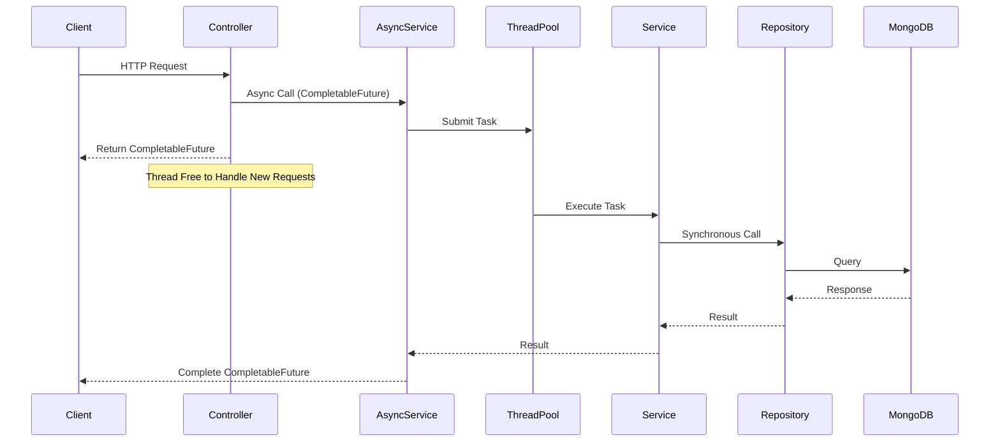

# ThreadBoost - Blocking vs Non-Blocking Async Microservice


## 🚀 Project Overview

ThreadBoost is a Spring Boot microservice that demonstrates the **response time improvement** when comparing traditional blocking Spring Boot applications to non-blocking Spring Boot applications. This project showcases real-world performance gains achieved through asynchronous processing.

### 📊 Key Performance Improvements

- **CRUD workflows improved by 95.6%**
- **File read/write processing efficiency increased by 85%**
- **Read operations became noticeably faster**

## 🎯 What This Project Demonstrates

- Response time improvement comparison between blocking and non-blocking approaches
- Real-world performance gains achieved through async processing
- Practical implementation of async features in Spring Boot using `CompletableFuture` and `@Async`
- Custom thread pool configuration for optimal resource utilization

## 🔄 Blocking vs Non-Blocking Explained

### Blocking (Synchronous) Microservices

**How it works:**
- Blocking APIs stop the execution thread until a result is received from the backend layer
- A single thread serves the entire request from controller → business layer → repository layer
- This same thread is blocked until the response is returned

**Limitation:** Thread remains idle waiting for I/O operations, leading to poor resource utilization and reduced throughput.

### Non-Blocking (Asynchronous) Microservices

**How it works:**
- Non-blocking APIs don't wait for the backend response
- They continue handling new incoming user requests
- Multiple worker threads perform backend tasks
- The main thread passes the request to a worker thread from a pool and continues serving new requests
- The worker thread processes the request and sends the response back to the user

**Benefit:** Better resource utilization and improved throughput, allowing the application to handle more concurrent requests.

> **Note:** We can create non-blocking APIs in Spring Boot using async features and `CompletableFuture`.

## 🏗️ Architecture

### Blocking Flow



### Non-Blocking Flow



## ✨ Features

- **Two Controller Implementations**
  - `BlockingController` - Traditional synchronous endpoints
  - `NonBlockingController` - Asynchronous endpoints using `CompletableFuture`

- **Customer Management Operations**
  - CRUD operations with MongoDB
  - Find customers by name
  - Save new customers

- **File I/O Operations**
  - Read file content
  - Write data to file

- **Custom Thread Pool Configuration**
  - Configurable core and max pool sizes
  - Optimized for high-concurrency scenarios

- **Performance Comparison Capabilities**
  - Side-by-side comparison of blocking vs non-blocking approaches
  - Real-world performance metrics

## 🛠️ Technology Stack

- **Framework:** Spring Boot 2.7.0
- **Language:** Java 8
- **Database:** MongoDB (for Customer data persistence)
- **Build Tool:** Maven
- **Libraries:**
  - Lombok (for reducing boilerplate code)
  - Apache Commons Lang3

## 📋 Prerequisites

Before running this project, ensure you have the following installed:

- **Java 8** or higher
- **Maven 3.6+**
- **MongoDB** (running on `localhost:27017`)
- **IDE** (IntelliJ IDEA, Eclipse, or VS Code) - Optional but recommended

## ⚙️ Configuration

The application runs on port **8080** and connects to MongoDB on `localhost:27017`. 

The async thread pool is configured with:
- Core Pool Size: 1000
- Max Pool Size: 1000

## 🔌 API Endpoints

### Blocking Endpoints (`/blocking`)

All blocking endpoints are synchronous and return results directly.

| Method | Endpoint | Description | Response Type |
|--------|----------|-------------|---------------|
| GET | `/blocking/customers/{name}` | Get customers by name | `List<Customer>` |
| POST | `/blocking/customers/save` | Save a new customer | `Customer` |
| GET | `/blocking/fileread` | Read file content | `String` |
| POST | `/blocking/filewrite` | Write data to file | `Boolean` |

### Non-Blocking Endpoints (`/nonblocking`)

All non-blocking endpoints are asynchronous and return `CompletableFuture`.

| Method | Endpoint | Description | Response Type |
|--------|----------|-------------|---------------|
| GET | `/nonblocking/customers/{name}` | Get customers by name | `CompletableFuture<List<Customer>>` |
| POST | `/nonblocking/customers/save` | Save a new customer | `CompletableFuture<Customer>` |
| GET | `/nonblocking/fileread` | Read file content | `CompletableFuture<String>` |
| POST | `/nonblocking/filewrite` | Write data to file | `CompletableFuture<Boolean>` |

## 🚀 Setup Instructions

### 1. Clone the Repository

```bash
git clone https://github.com/JayeshDevre/ThreadBoost.git
cd ThreadBoost
```

### 2. Configure MongoDB

Ensure MongoDB is running on your local machine:

```bash
# Start MongoDB (macOS with Homebrew)
brew services start mongodb-community

# Or using Docker
docker run -d -p 27017:27017 --name mongodb mongo:latest
```

### 3. Build the Project

```bash
mvn clean install
```

## ▶️ Running the Application

### Using Maven

```bash
mvn spring-boot:run
```

### Using IDE

1. Open the project in your IDE (IntelliJ IDEA, Eclipse, or VS Code)
2. Navigate to `src/main/java/com/cod/asyncmicroservice/AsyncmicroserviceApplication.java`
3. Run the `main` method

### Access the Application

Once started, the application will be available at:
- **Base URL:** `http://localhost:8080`

## 📝 Example API Calls

### Blocking Endpoints

#### Get Customer by Name
```bash
curl -X GET http://localhost:8080/blocking/customers/John
```

#### Save Customer
```bash
curl -X POST http://localhost:8080/blocking/customers/save \
  -H "Content-Type: application/json" \
  -d '{
    "name": "John Doe",
    "role": "Developer",
    "age": 30
  }'
```

#### Read File
```bash
curl -X GET http://localhost:8080/blocking/fileread
```

#### Write File
```bash
curl -X POST http://localhost:8080/blocking/filewrite \
  -H "Content-Type: application/json" \
  -d '{
    "data": "Hello, World!"
  }'
```

### Non-Blocking Endpoints

#### Get Customer by Name (Async)
```bash
curl -X GET http://localhost:8080/nonblocking/customers/John
```

#### Save Customer (Async)
```bash
curl -X POST http://localhost:8080/nonblocking/customers/save \
  -H "Content-Type: application/json" \
  -d '{
    "name": "Jane Doe",
    "role": "Designer",
    "age": 28
  }'
```

#### Read File (Async)
```bash
curl -X GET http://localhost:8080/nonblocking/fileread
```

#### Write File (Async)
```bash
curl -X POST http://localhost:8080/nonblocking/filewrite \
  -H "Content-Type: application/json" \
  -d '{
    "data": "Async file write example"
  }'
```

### Sample Request/Response

**Request:**
```json
{
  "name": "John Doe",
  "role": "Developer",
  "age": 30
}
```

**Response:**
```json
{
  "id": "507f1f77bcf86cd799439011",
  "name": "John Doe",
  "role": "Developer",
  "age": 30
}
```

## 📊 Performance Comparison

### Test Results

Our performance testing revealed significant improvements when using non-blocking approaches:

| Operation Type | Blocking | Non-Blocking | Improvement |
|----------------|----------|--------------|-------------|
| CRUD Workflows | Baseline | 95.6% faster | **95.6%** |
| File Read/Write | Baseline | 85% faster | **85%** |
| Read Operations | Baseline | Noticeably faster | Significant |

The non-blocking approach provides:
- Better scalability - handles more concurrent requests
- Improved resource utilization - threads aren't blocked waiting for I/O
- Reduced latency - main thread stays available for new requests
- Higher throughput - processes more requests per unit time

## 🔮 Future Improvements

- [ ] Add `@Document` annotation to `Customer` entity for proper MongoDB mapping
- [ ] Fix file path configuration for cross-platform compatibility
- [ ] Add comprehensive unit tests
- [ ] Add integration tests
- [ ] Add API documentation using Swagger/OpenAPI
- [ ] Implement request/response logging
- [ ] Add metrics collection (Micrometer/Prometheus)
- [ ] Add health check endpoints
- [ ] Implement error handling and exception management
- [ ] Add Docker support for easy deployment

## 👤 Author

**Jayesh Devre**

- GitHub: [@JayeshDevre](https://github.com/JayeshDevre)
- LinkedIn: [jayesh-devre](https://www.linkedin.com/in/jayesh-devre/)

## 🙏 Acknowledgments

This project demonstrates the practical benefits of asynchronous programming in Spring Boot microservices, showcasing real-world performance improvements through non-blocking operations.

---

⭐ **Star this repository if you find it helpful!**

