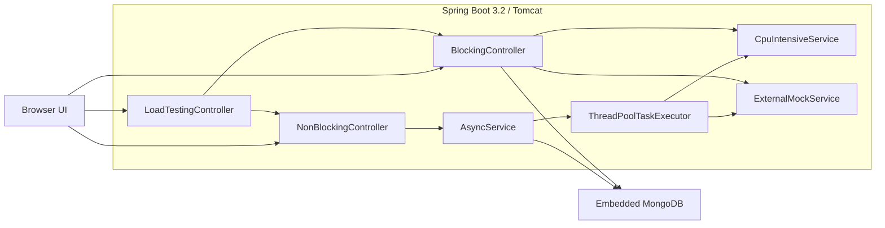
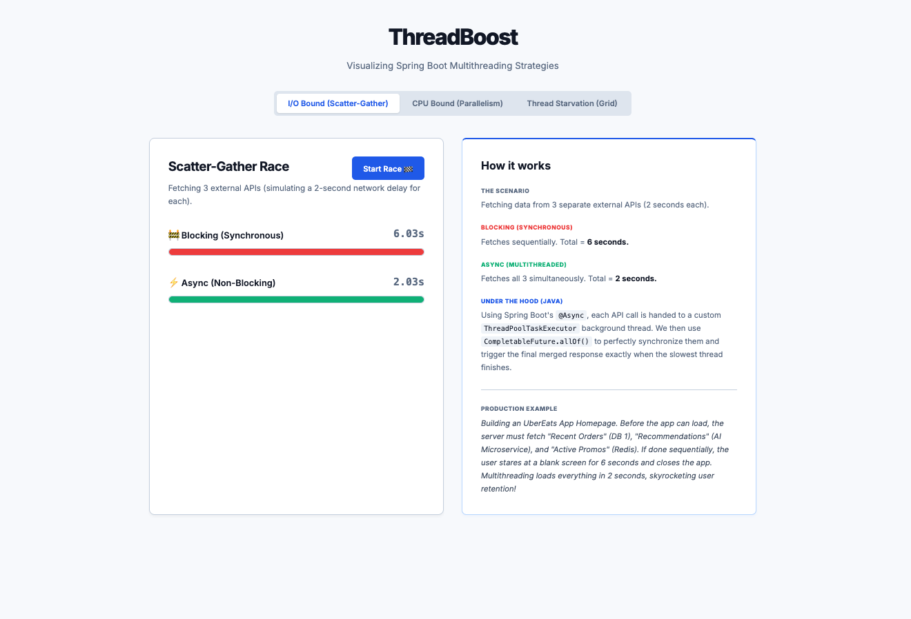
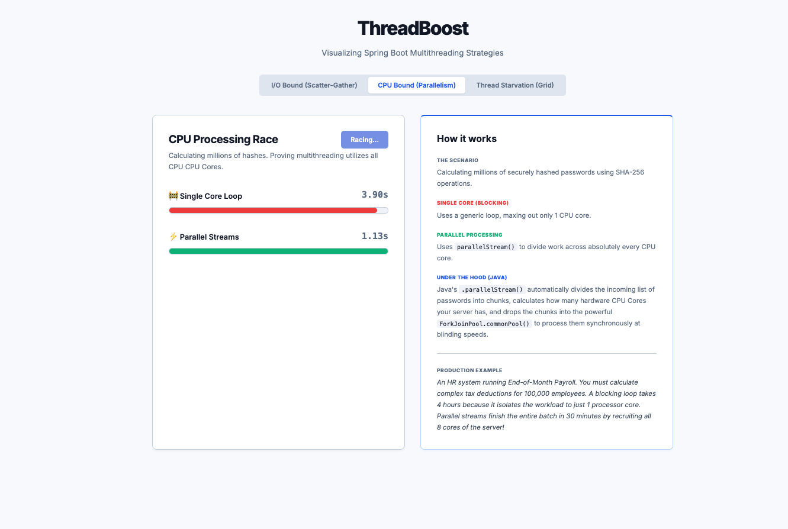
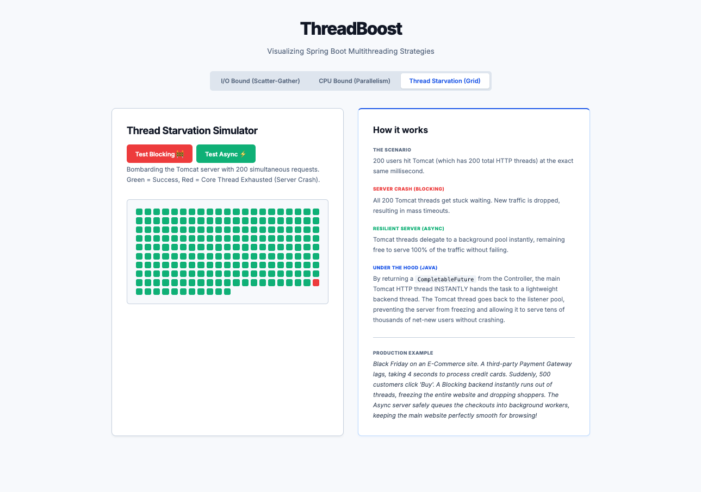

# ThreadBoost

A zero-configuration Spring Boot application that **visually demonstrates** why multithreading matters — through interactive, real-time benchmarks you can run in your browser.

> Clone → `mvn spring-boot:run` → Open `http://localhost:8080` → Done.  
> No MongoDB install. No config files. No environment variables.

---

## What It Does

ThreadBoost runs three live experiments, each targeting a different concurrency bottleneck:

| Tab | Concept | Blocking Approach | Multithreaded Approach |
|-----|---------|-------------------|------------------------|
| **I/O Race** | Scatter-Gather | Sequential API calls (6s) | `CompletableFuture.allOf()` (2s) |
| **CPU Race** | Parallelism | Single-core `for` loop | `parallelStream()` across all cores |
| **Thread Starvation** | Resource Exhaustion | Tomcat threads freeze (mass timeouts) | Async delegation (100% success) |

Each experiment has a side-by-side explanation panel with the Java API used and a real-world production scenario.

---

## Tech Stack

| Layer | Technology |
|-------|-----------|
| Framework | Spring Boot 3.2.0 |
| Language | Java 17 |
| Database | Embedded MongoDB (Flapdoodle) — runs in RAM, zero setup |
| Build | Maven |
| Frontend | Vanilla HTML/CSS/JS — no npm, no bundler |

---

## Architecture

### System Overview



---

## Quick Start

**Prerequisites:** Java 17+, Maven 3.6+

```bash
git clone https://github.com/JayeshDevre/ThreadBoost.git
cd ThreadBoost
mvn spring-boot:run
```

Open **http://localhost:8080** and start clicking.

---

## Project Structure

```
src/main/java/com/cod/asyncmicroservice/
├── config/
│   └── AsyncThreadPoolConfig.java       # Custom ThreadPoolTaskExecutor
├── business/
│   ├── AsyncService.java                # @Async wrappers returning CompletableFuture
│   ├── CpuIntensiveService.java         # SHA-256 hashing (sequential vs parallel)
│   ├── ExternalMockService.java         # Simulated 2-second external API calls
│   ├── CustomerService.java             # MongoDB CRUD
│   └── FileService.java                 # File I/O operations
├── controller/
│   ├── BlockingController.java          # Synchronous endpoints
│   ├── NonBlockingController.java       # Async endpoints
│   └── LoadTestingController.java       # 200-request thread starvation test
└── domain/
    ├── Customer.java
    ├── FileData.java
    └── DashboardResponse.java
```

---

## API Reference

### Core Endpoints

| Method | Path | Description |
|--------|------|-------------|
| GET | `/blocking/dashboard` | Blocking scatter-gather (3 APIs sequentially) |
| GET | `/nonblocking/dashboard` | Async scatter-gather (`CompletableFuture.allOf`) |
| GET | `/blocking/cpu-heavy` | SHA-256 hashing on single core |
| GET | `/nonblocking/cpu-heavy` | SHA-256 hashing via `parallelStream()` |
| GET | `/loadtest/blocking` | Fire 200 concurrent requests at blocking endpoint |
| GET | `/loadtest/nonblocking` | Fire 200 concurrent requests at async endpoint |

### CRUD Endpoints

| Method | Path | Description |
|--------|------|-------------|
| GET | `/blocking/customers/{name}` | Get customers by name (sync) |
| POST | `/blocking/customers/save` | Save customer (sync) |
| GET | `/nonblocking/customers/{name}` | Get customers by name (async) |
| POST | `/nonblocking/customers/save` | Save customer (async) |

---

## Key Concepts Demonstrated

### 1. Scatter-Gather Pattern
Three independent I/O calls run on separate threads via `@Async` and merge with `CompletableFuture.allOf()`. Cuts latency from the sum of all calls to the duration of the slowest one.

### 2. CPU Parallelism
`parallelStream()` distributes SHA-256 computation across all available cores using the `ForkJoinPool`. A single-core loop leaves most of the CPU idle.

### 3. Thread Starvation
Tomcat's default thread pool (200 threads) is finite. Blocking endpoints hold threads hostage during slow I/O, causing new requests to queue and timeout. Returning `CompletableFuture` from controllers frees the HTTP thread immediately, preventing exhaustion.

---

## Screenshots

### I/O Bound — Scatter-Gather Race


### CPU Bound — Parallel Stream Processing


### Thread Starvation — 200 Concurrent Request Grid


---

## Author

**Jayesh Devre**  
[GitHub](https://github.com/JayeshDevre) · [LinkedIn](https://www.linkedin.com/in/jayesh-devre/)
